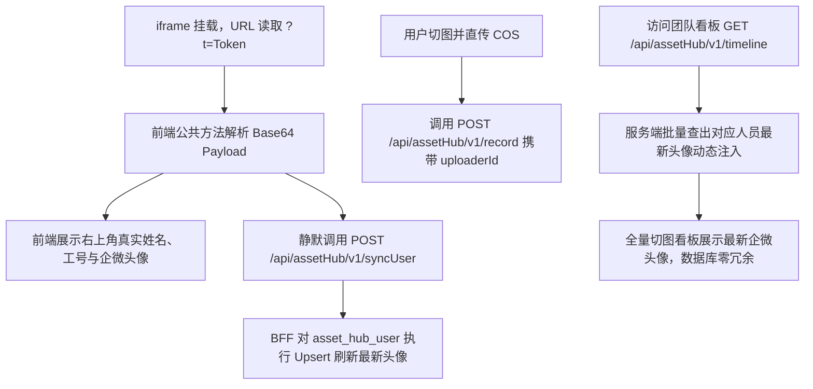

# AssetHub 轻量用户花名册与 Token 解析方案 PRD

## 一、方案背景与架构选型

在 AssetHub 切图效能工作台中，用户身份信息源自父窗口或者当前 iframe URL 中的 Token 参数（`?t=...`）。解析后可直接获取如下信息：
```json
{
  "name": "张三",
  "userId": "20260411006",
  "username": "20260411006",
  "rawPayload": {
    "sub": "20260411006",
    "name": "张三",
    "avatar": "https://wework.qpic.cn/wwpic/527944_8RchLjV5SQmE3ix_164966666/0",
    "email": "123456@qq.com",
    "exp": 1790473859,
    "iat": 1789869059
  }
}
```

### 为什么采用方案一（轻量花名册镜像表），而非在切图表中冗余头像？
1. **彻底消除物理存储冗余**：企微头像 URL 普遍在 80~120 字节。若在几万条切图记录中重复存储，会浪费大量空间；
2. **解决头像失效与换头像一致性**：企业微信头像 URL 存在时效性或员工更换头像场景。如果在切图表中硬编码存储，历史数据将产生大量“死链”或“旧头像”；
3. **架构极简免维护**：仅维护全团队几十条记录的 `asset_hub_user` 镜像集合，切图表瘦身只存 `uploaderId`（工号）与 `uploaderName`（姓名）。

---

## 二、数据模型定义

### 1. 用户花名册镜像集合 (`asset_hub_user`)
- **文件路径**：`src/mongodb/models/assetHub/AssetUser.ts`
- **主键索引**：`userId` 唯一索引

| 字段名 | 类型 | 说明 |
| :--- | :--- | :--- |
| `userId` | String | 用户工号/唯一ID (主键索引) |
| `username` | String | 账号名 |
| `name` | String | 真实姓名 |
| `avatar` | String | 企业微信最新头像 URL |
| `email` | String | 电子邮箱 |
| `createTime` | String | 首次访问建档时间 |
| `updateTime` | String | 最近访问刷新时间 |

### 2. 切图资产集合瘦身 (`asset_hub_cos`)
- **文件路径**：`src/mongodb/models/assetHub/CosAsset.ts`
- **调整**：移除冗余的 `avatar` 字段，严格保留 `uploaderId`（工号，加普通索引）与 `uploaderName`（姓名）。

---

## 三、接口设计与工作流



### 1. 静默同步接口
- **路由**：`POST /api/assetHub/v1/syncUser`
- **文件**：`src/api/assetHub/v1/syncUser.post.ts`
- **机制**：前端开屏自动触发，BFF `findOneAndUpdate(..., { upsert: true })`，毫秒级静默完成。

### 2. 时间轴查询动态注入
- **路由**：`GET /api/assetHub/v1/timeline`
- **文件**：`src/api/assetHub/v1/timeline.get.ts`
- **机制**：支持按 `uploaderId` 过滤“我的上传”；返回时提取当前页所有 `uploaderId`，单次 `$in` 批量命中最新头像注入 `uploaderAvatar`。

---

## 四、前端公共解析与缓存方案

- **公共工具文件**：`src/utils/user.ts`
- **核心方法**：
  * `getUserInfoFromUrlToken()`: 从 URL 查询参数 `t` 解析 JWT Payload，兼容 base64url，支持中文字符正确反序列化，并写入 `sessionStorage` 防止刷新丢失；
  * `getCurrentUser()`: 优先读取 Token，无 Token 时安全回退至开发环境预设账号；
  * `initAndSyncUser()`: 初始化并自动触发 BFF 静默同步。
