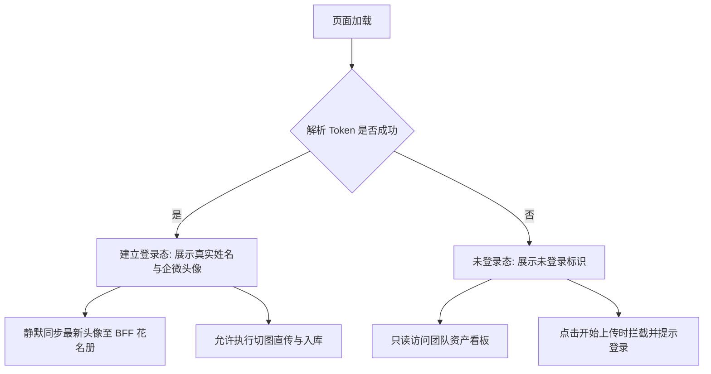

# AssetHub 严格鉴权与 COS 凭证生命周期管理 PRD

## 一、方案背景与目标

在企业级静态资源效能工作台 (AssetHub) 中，为了保障公司资源资产的合规上传与溯源追踪，必须对上传行为建立严格的鉴权机制，并对 COS 临时授权凭证建立精确的有效期生命周期管理。

### 核心变更目标
1. **彻底移除开发兜底模拟用户**：生产与调试均严格按真实 Token 解析，未登录时严禁以模拟工号（如 `20260411006 / 张三`）伪装登录；
2. **未登录状态明确提示与权限边界**：
   - 导航栏明确展示“未登录”状态与匿名标识；
   - 开放只读看板（团队资产库、时间轴、画质比对器、代码生成器等）；
   - 严格拦截上传操作（拖拽直传、批量上传入库均被拦截并友好轻提示引导登录）；
3. **COS 授权就绪状态精准化**：
   - 杜绝静态常驻的假就绪状态；
   - 仅在成功获取到腾讯云 STS 临时凭证且处于有效期内（`now < expiredTime`）时显示“COS 授权就绪”绿色脉冲徽标；
   - 凭据未获取或过期失效时显示未授权/已过期警示，并支持自动刷新。

---

## 二、详细设计与状态流转

### 1. 用户鉴权状态设计 (`IUserInfo | null`)

- **解析链路**：`URL ?t=...` -> `sessionStorage 缓存` -> `IUserInfo | null`。
- **未登录判定**：若上述链路皆无有效工号 (`userId`)，则确定为未登录 (`null`)。

### 2. COS 凭证生命周期与状态机设计

| 状态枚举 | 说明 | 徽标展示 | 脉冲动效 |
| :--- | :--- | :--- | :--- |
| `UNAUTHORIZED` | 尚未获取到 STS 凭据 | 灰底·COS 未授权 | 无脉冲 |
| `READY` | 成功获取凭证且在有效期内 | 浅绿底·COS 授权就绪 | 绿色微动呼吸灯 |
| `EXPIRED` | 超过 STS 凭据有效时间 | 琥珀底·凭据已过期 | 橙色警示 |

- **刷新机制**：STS 凭据由服务端派发（通常有效时长 1800s~7200s）。
- 前端记录 `startTime` 与 `expiredTime`，通过定时器动态维系凭据状态；在发起上传或手动检测时，若已过期则自动发起重授。

---

## 三、受影响文件与改造清单

1. **`src/utils/user.ts`**：
   - 移除 `DEFAULT_FALLBACK_USER`；
   - `getCurrentUser()` 返回 `IUserInfo | null`；
   - `initAndSyncUser()` 在未登录时不向服务端发送无意义同步。

2. **`src/services/cosUploader.ts`**：
   - 暴露响应式或可查询的 COS 凭据状态 `cosAuthState` (`UNAUTHORIZED` / `READY` / `EXPIRED`)；
   - 在成功获取凭据时更新状态并登记有效时间戳；
   - 提供凭证有效性检查与预检授权方法。

3. **`src/components/Navbar.vue`**：
   - 用户栏在未登录时展示“未登录”气泡徽标与匿名灰色头像；
   - 状态胶囊动态根据 `cosAuthState` 显示不同色彩与文案。

4. **`src/composables/useAssetQueue.ts` & `src/App.vue`**：
   - 在执行批量上传前判定登录状态，未登录时拦截并给出引导轻提示；
   - 在页面初始化时触发安全授权探测，使“COS 授权就绪”在有效状态下点亮。
