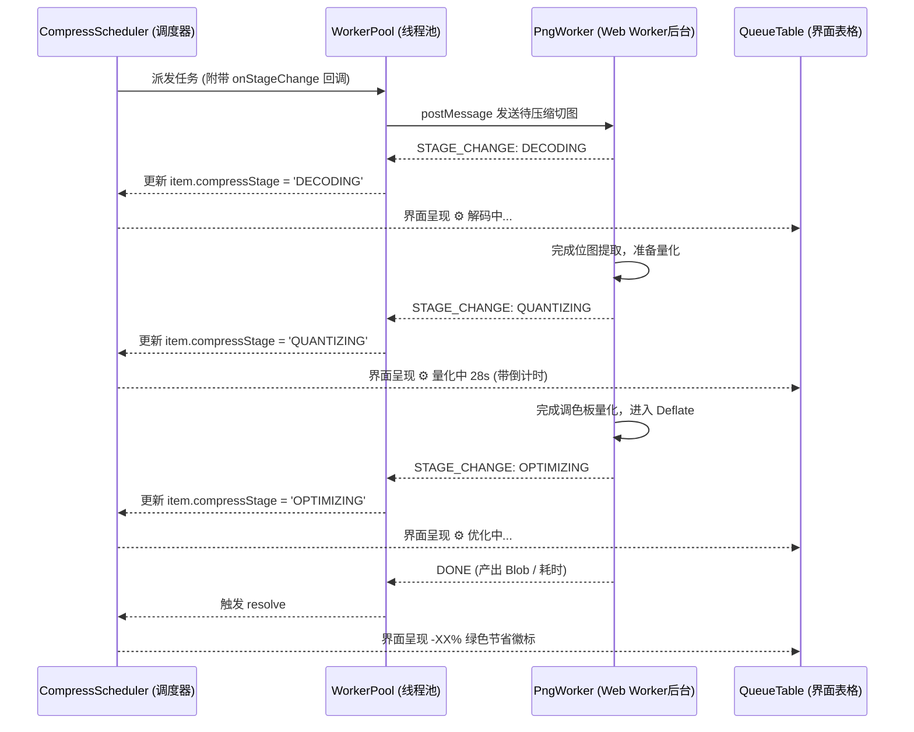

# 14_压缩阶段化管道进度优化 PRD

## 一、需求背景与目标

在接入 Web Worker 极速全并发后，Wasm 密集运算已成功移出主线程。针对用户提出的“压缩是否有具体进度”的诉求：
1. **黑盒瓶颈**：WebAssembly 底层导出的 `zx_quantize` 属于原子计算，无法在 Wasm 虚拟机内部抛出逐像素线性进度；
2. **阶段化透明度（方案一）**：将黑盒拆解为工业级阶段化管道进度：
   - **阶段 1：解码像素 (`DECODING`)**：读取 Blob 数据，利用 `createImageBitmap` + `OffscreenCanvas` 提取 RGBA 像素矩阵；
   - **阶段 2：调色板量化 (`QUANTIZING`)**：后台运行 Wasm `imagequant` 调色板聚类与色彩抖动，配合独立 30s 倒计时动态跳动；
   - **阶段 3：无损编码优化 (`OPTIMIZING`)**：将量化矩阵生成 PNG 并由 `oxipng` 进行 Deflate 深度压缩优化；
   - **阶段 4：产物交付**：生成最终 Blob，计算体积节省率，呈现绿徽或保底；
3. **视觉反馈**：表格行的微晶徽标随当前阶段实时变化，让用户清晰获知处理进程，彻底消除焦虑。

---

## 二、架构设计与数据流

---

## 三、涉及改动文件清单

1. `src/types/asset.ts`：在 `IQueueItem` 中增加 `compressStage` 字段；
2. `src/workers/pngCompressor.worker.ts`：在解码前、量化前、优化前通过 `postMessage` 发送 `STAGE_CHANGE` 阶段通知；
3. `src/utils/workerPool.ts`：在监听器中识别 `STAGE_CHANGE` 消息并触发 `onStageChange` 回调；
4. `src/utils/compressor.ts`：为 `compressImageInBrowser` 增加入参支持 `onStageChange`；
5. `src/utils/compressScheduler.ts`：在任务启动时初始化 `compressStage` 并绑定阶段回调；
6. `src/components/QueueTable.vue`：在测算中徽标处细化展现 `解码中...`、`量化中 28s`、`优化中...`；
7. `contexts/context.md`：同步追加 PRD 14 索引。
