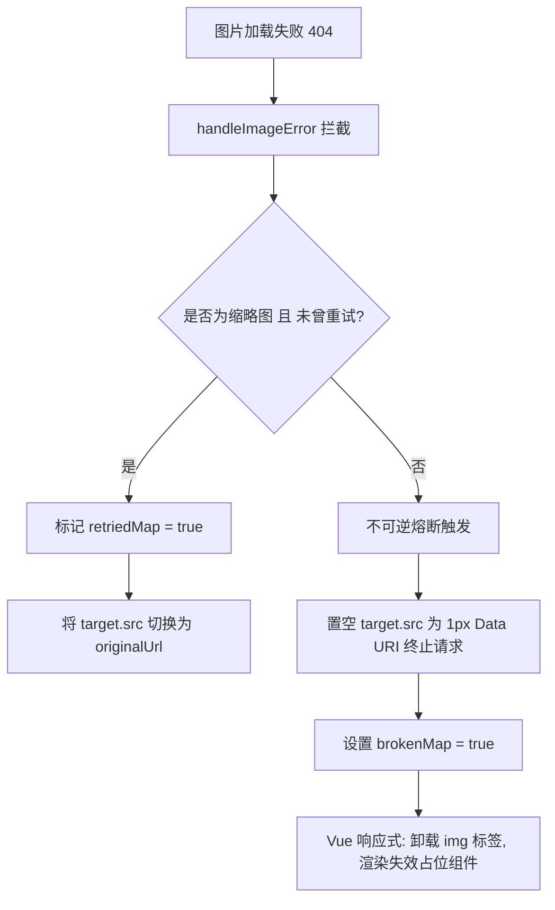

# 团队资产时间轴切图 404 无限重试熔断与失效缺省占位 PRD

## 一、需求背景与现状痛点

在团队资产库时间轴视图（`TimelineList.vue`）中，部分历史切图在云端存储桶（COS）中已被物理删除或移走。当用户滚动浏览到这些历史条目时：
1. 图片首先尝试以压缩缩略图参数（`imageView2/2/w/320/h/320...`）发起加载，云端返回 404；
2. 触发 `@error` 事件后，代码执行 `handleImageError` 尝试将 `src` 指向原始原图 `originalUrl`；
3. 由于原图在云端同样不存在（404），浏览器再次触发 `@error` 事件；
4. 此时由于 `target.src`（经浏览器解析包含绝对协议或已转义字符）与原 URL 对比偏差、或者缺乏重试次数标记，导致反复进入赋值与网络请求死循环；
5. 短时间内爆发海量 404 请求，阻塞浏览器渲染主线程与网络通道，直接引发页面无响应与浏览器假死（Crash/Freeze）。

---

## 二、功能目标

1. **死循环彻底熔断（Circuit Breaker）**：
   - 严格限制每个资产仅允许最多 1 次“缩略图 -> 原图”回退尝试；
   - 只要原图再次返回 404，或者原图本身直接 404，立即触发不可逆熔断，彻底阻断任何后续网络请求与事件循环。
2. **DOM 级销毁与状态响应**：
   - 通过 Vue 响应式状态 `brokenMap` 驱动，在熔断发生时直接通过 `v-if` 将 `` 标签从 DOM 中卸载销毁，彻底从底层避免监听器复发；
   - 立即清空游离 image 的网络请求通道。
3. **高奢缺省占位与交互兜底**：
   - 呈现符合系统高奢磨砂质感的失效占位舞台（微虚线边框、切图下线图标、404 Not Found 标示）；
   - 失效卡片微调透明度，呈现已下线优雅质感；
   - 点击失效卡片时拦截全屏大图预览弹窗，并弹出友好 Toast 提示，保障应用健壮性。

---

## 三、详细设计与实现方案

### 3.1 熔断与状态数据结构
- `retriedMap: Record<string, boolean>`：记录已尝试过原图回退的 URL，确保降级尝试仅触发 1 次；
- `brokenMap: Record<string, boolean>`：记录已确认彻底失效（404）的 URL，驱动模板显示缺省态并卸载 `img` 节点。

### 3.2 错误拦截算法流程

### 3.3 交互细节
- **预览大图**：若资源已在 `brokenMap` 中，点击卡片不再触发 `open-preview`，而是触发 `show-toast`（“该切图云端资源已不存在 (404)，无法查看大图”）；
- **复制链接**：依然保持可用，方便研发/设计复制失效链接排查。

---

## 四、影响范围

- 涉及文件：
  - `src/components/TimelineList.vue`
- 不影响后端接口及其他组件。
