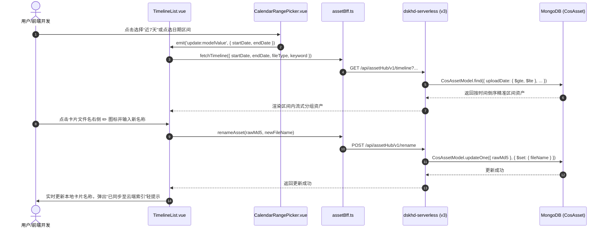

# 团队资产多维检索日历选择与云端更名 PRD

## 一、需求背景与目标

随着团队沉淀的切图资产数量日益膨胀，出现两个关键管理与检索痛点：
1. **深分页疲劳与时间窗口模糊**：用户翻查几个月前的历史资产只能靠连续向下滚动加载，检索成本极高；且单一关键词搜索在遇到通用切图名（如 `icon.png`）时命中条目过多。
2. **切图名缺乏语义化**：历史资产中有大量自动生成的系统名（如 `IMG_202409...`、`component_12`），严重降低了模糊搜索命中率，团队复用困难。

### 核心目标
1. **日历范围选择工具（CalendarRangePicker）**：提供轻量高奢的日历范围选择器，支持快捷预设（近 7 天/近 30 天/本月）与月历点选自定义起止日期，精准收窄时间窗口；
2. **多维格式筛选（Format Filter）**：支持一键按文件格式（全部/PNG/SVG/WebP/JPG/GIF）过滤；
3. **卡片行内更名改库（Inline Rename）**：提供类似上传队列的铅笔 ✏️ 图标，点击行内展开微编辑面板，一键更新 MongoDB 中的 `fileName`，实时同步云端索引便于后续检索。

---

## 二、系统架构与数据链路



---

## 三、接口定义与数据规范

### 3.1 资产时间轴查询接口扩展
- **接口路径**：`GET /api/assetHub/v1/timeline`
- **新增 Query 参数**：
  | 字段名 | 类型 | 说明 | 示例 |
  | :--- | :--- | :--- | :--- |
  | `startDate` | string | 起始上传日期 (YYYY-MM-DD) | `2026-09-01` |
  | `endDate` | string | 截止上传日期 (YYYY-MM-DD) | `2026-09-22` |
  | `fileType` | string | 文件格式，自动兼容 jpg/jpeg | `png` / `jpg` |

### 3.2 资产更名接口新增
- **接口路径**：`POST /api/assetHub/v1/rename`
- **请求体 (JSON)**：
  | 字段名 | 类型 | 必填 | 说明 |
  | :--- | :--- | :--- | :--- |
  | `rawMd5` | string | 是 | 原图 MD5 唯一指纹 |
  | `newFileName` | string | 是 | 用户修改后的新文件名 |
- **响应体**：
  ```json
  {
    "code": 0,
    "msg": "success",
    "data": {
      "rawMd5": "e2fc714c4727ee9395f324cd2e7f331f",
      "fileName": "icon_share_vip.png",
      "updateTime": "2026-09-22 15:55:00"
    }
  }
  ```

---

## 四、前端交互与 UI 规范

1. **日历范围选择组件**：
   - 顶部提供快捷时间胶囊：`全部时间` / `今天` / `近 7 天` / `近 30 天` / `本月`；
   - 支持点击展开毛玻璃月历，直观点击选择起始与截止日期，鼠标悬浮范围高亮联动；
   - 支持跨月份切换与快速清空复位。
2. **文件格式筛选下拉胶囊**：
   - 紧凑微光下拉胶囊：`全部格式` / `PNG` / `SVG` / `WebP` / `JPG` / `GIF`。
3. **卡片行内铅笔更名**：
   - 鼠标悬浮在卡片文件名时显现 ✏️ 图标；
   - 点击展开输入面板，自动选中主文件名（保护原有文件后缀）；
   - 支持回车（Enter）保存、Esc 取消；
   - 保存中展示提交动画，成功后无感知更新卡片并给出全局 Toast。

---

## 五、影响范围
- 后端：`src/api/assetHub/v1/timeline.get.ts`、`src/api/assetHub/v1/rename.post.ts`
- 前端：`src/services/assetBff.ts`、`src/components/CalendarRangePicker.vue`、`src/components/TimelineList.vue`
