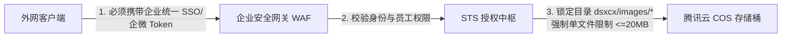

# AssetHub - 企业级前端静态资源效能工作台

> **百果园前端效能团队核心资产基础设施**  
> 集成了 WebAssembly 本地高保真量化压缩、腾讯云 COS 客户端直传、原图 MD5 秒传查重、多端交付代码生成、1:1 卷帘画质对比、团队资产时间轴看板，以及基于 `app-config.js` 的免编译外置化交付架构。

---

## 🌟 核心特性与架构蓝图

1. **多引擎 WebAssembly 本地高保真量化压缩**：
   - **PNG**：集成 `imagequant` (pngquant) + `squoosh_oxipng` Wasm，结合 `UPNG.js` 真正输出 TinyPNG 级别 8-bit 索引色调色板，体积直降 70%~80%，完美保留 Alpha 半透明与边缘羽化；
   - **GIF 动图**：集成 `gifsicle-wasm-browser` 独立 Web Worker 引擎，多帧 `-O2 --lossy=40` 差分量化，**100% 保持动画帧序列、帧延迟与循环播放**，绝不退化为静态死图；
   - **JPEG / WebP**：原生 `window.createImageBitmap` + Canvas 硬件加速极速编码；
   - **超大图智能直通**：2000万像素级超大图原画无损 5ms 毫秒级直通交付，0 算力浪费，彻底杜绝浏览器假死；
2. **零带宽直传腾讯云 COS**：前端获取 STS 临时凭据后直传腾讯云存储桶，内部 BFF 零二进制中转带宽压力；
3. **原图 MD5 秒传查重**：SparkMD5 客户端秒级散列，批量预检比对历史切图，重复切图一键复用直链，杜绝冗余资产；
4. **外置运行时交付架构（零重新编译）**：彻底废除 `.env`，统一收拢为 `app-config.js` 单一可信源。部署现场使用记事本修改配置后刷新浏览器立即生效；
5. **团队资产时间轴与企微花名册镜像**：开屏静默同步企微头像与工号，切图主表零头像冗余存储，时间轴动态展示团队累计节省带宽；
6. **1:1 物理卷帘画质对比与代码生成**：支持 10%~800% 锚点缩放与平移比对，一键生成 Vue / 微信小程序 / CSS / React 交付代码。

---

## ⚙️ 交付与配置指南 (单一可信源：app-config.js)

本系统已彻底废弃 `.env` 环境变量体系，所有存储桶、网关接口与常用目录统一收拢至外置配置文件中：
- **本地开发调试**：直接编辑 [public/app-config.js](./public/app-config.js)，热更新立即生效；
- **生产交付部署**：执行 `yarn build` 后，产物根目录下直出 `dist/app-config.js`。**现场实施与运维人员无需安装 Node.js，直接用记事本修改该文件，按 F5 刷新网页即刻生效，完全无需重新打包源码！**

### 配置文件结构示例 (`app-config.js`)：
```javascript
window.__ASSET_HUB_CONFIG__ = {
  // 网页标题与工作台品牌
  title: 'AssetHub - 静态资源效能工作台',

  // 生产环境常用业务文件夹快捷下拉选项 (可自由增删改)
  prodDirPresets: [
    'dsxcx/images',
    'dsxcx/evaluation',
    'dsxcx/feedback',
  ],

  // 环境与存储桶预设列表 (支持配置 1 个、2 个或任意多个环境)
  targets: [
    {
      id: 'prod-wxapp',
      label: '🚀 【生产线上】微信小程序主图床',
      env: 'prod',
      authUrl: 'http://example.com.cn/api/getCosAuthorization',
      bffBaseUrl: 'http://example.com.cn/api/assetHub/v1',
      cosKey: 'COS_KEY_NAME',
      bucket: 'bucket-prod-name',
      region: 'ap-guangzhou',
      defaultDir: 'cos/images',
      cdnPrefix: 'https://resource.example.com.cn',
      description: '线上正式业务图床，支持指定业务文件夹，具备专有 CDN 加速',
    },
    {
      id: 'test-wxapp',
      label: '🧪 【测试沙箱】DSKHD 业务桶',
      env: 'test',
      authUrl: 'http://example.com.cn/api/getCosAuthorization',
      bffBaseUrl: 'http://example.com.cn/api/assetHub/v1',
      cosKey: 'COS_KEY_NAME',
      bucket: 'bucket-prod-name',
      region: 'ap-guangzhou',
      defaultDir: 'cos/images',
      cdnPrefix: '',
      description: '测试沙箱模式，切图统一上传至 dsxcx/temp/ 临时目录，后续由管理员批量清理',
    },
  ],
}
```

---

## ⚠️ 核心安全警示与外网风险防范指南（必读）

> [!CAUTION]
> **高危警示：切勿直接将当前工程在未经身份网关加固的情况下暴露至公网（外网）！**  
> 若直接将此工作台发布至互联网且服务端接口未增加权限拦截，系统将面临极高的滥用与投毒风险。

### 1. 现存外网暴露风险点成因

1. **STS 凭据接口完全免鉴权**：
   在底层服务端（`dskhd-serverless`）中，`/api/getCosAuthorization` 被配置在 `unAuthAccessTokenApiList`（免 Token 白名单）中。外网攻击者只需构造一个 POST 请求即可无条件换取腾讯云有效临时凭据（`tmpSecretId`、`tmpSecretKey`、`sessionToken`）；
2. **服务端 STS 授权范围通配（无目录约束）**：
   生产图床的 Policy 资源通配为 `prefix//name/bucket-prod/*`，攻击者不仅能上传图片，还可以向存储桶任意目录上传大文件；
3. **纯前端拦截防君子不防小人**：
   前端代码层面的 `getCurrentUser()` 检查在浏览器中极易被绕过，黑客更可通过自动化脚本绕过前端直调后端；
4. **被恶意滥用的灾难性后果**：
   - **天价存储与流量账单**：被黑产用作免费无限私有网盘或非法图床，批量上传数百 GB/TB 级视频，造成巨额资金损失；
   - **主营业务域名被封杀（P0 级风险）**：若被利用上传违禁、侵权或违规文件，腾讯云专有 CDN 域名 `https://resource.example.com.cn` 会被工信部或微信管局拦截拉黑，**导致微信小程序线上商品图片全量裂开瘫痪**；
   - **生产切图被恶意篡改覆写**：具备 `PutObject` 权限时可覆盖线上已有业务切图。

### 2. 公网部署必须实施的“四重防御安全锁”

若工作台需要开放给远程员工、外包设计团队在外网使用，必须满足以下安全基线：



- **第一重·网关身份锁**：在 API 网关层（或 Nginx 反向代理层）拦截 `getCosAuthorization` 接口，必须验证企业微信扫码登录或 SSO JWT Token，非白名单人员直接拒绝签发凭据；
- **第二重·STS 最小权限锁**：服务端修改 Policy 生成逻辑，`resource` 强制锁死在 `dsxcx/images/*`（或特定日期目录），并在 Condition 中加入 `numeric_less_than_equal: { "cos:content-length": 20971520 }`，强行限制单文件不得超过 20MB；
- **第三重·CORS 与防盗链白名单**：腾讯云 COS 控制台严格配置 `AllowedOrigin` 仅允许公司指定前端域名，开启 Referer 限制；
- **第四重·云监控异动熔断**：配置腾讯云监控告警，当存储桶日写入量突增超过 20GB 时，立刻向运维发送紧急短信并自动触发安全熔断。

---

## 🚨 灾难自救预案：若密钥泄露且混入 32TB 垃圾数据如何处理？

> [!IMPORTANT]
> **事故处置第一铁律：严禁直接执行无差别批量删除脚本！**  
> 因为 32TB 垃圾数据与线上正常业务数据混在一个存储桶中，盲目删除会直接摧毁生产业务商品图，引发特大生产事故。

### 应急处置 5 步实战 SOP：

```
[步骤1: 紧急止血] ──> [步骤2: 防盗刷防天价账单] ──> [步骤3: 三维对账精准甄别] ──> [步骤4: 灰度隔离与冷归档] ──> [步骤5: 彻底物理销毁]
```

1. **步骤一：紧急止血（0 ~ 10 分钟）**
   - 登录腾讯云控制台 -> 访问管理 (CAM)，立即将泄露的子账号永久密钥（SecretId/SecretKey）设为**“禁用（Disabled）”**或删除；
   - 对该子账号附加一条临时的全局 Deny 策略，**瞬间作废全网所有已下发且未过期的 STS 临时 Token**；
   - 在网关层立刻将暴露的授权接口熔断切断。
2. **步骤二：开启 CDN 防盗链（10 ~ 30 分钟）**
   - 确保存储桶为私有读写，关闭匿名公网读；
   - CDN 控制台开启严格的 Referer 白名单与单 IP 频次限制，防止外部黑产通过批量下载恶意数据刷爆百万元 CDN 带宽账单。
3. **步骤三：3 维对账法精准甄别垃圾数据（核心防误伤）**
   - **业务数据库导出合法白名单（Golden Set）**：从生产 MySQL 商品库、MongoDB `asset_hub_cos` 表导出所有当前线上有记录的合法图片 Key 集合（`valid_keys.txt`）；
   - **时间戳分水岭排除**：排查审计日志定位泄露发生的具体起始时间点（例如 `2026-09-18 15:30:00`），该时间点前创建的对象 100% 安全，全部排除；
   - **腾讯云 COS 清单（Inventory）求差集**：在控制台开启“存储桶清单”，导出全桶对象 CSV 清单，运行离线脚本求差集：
     $$\text{全桶对象清单} - \text{业务数据库白名单} - \text{泄露前历史安全文件} = \text{32TB 垃圾文件清单 (trash\_keys.txt)}$$
4. **步骤四：降费 90% 与灰度隔离（绝不直接硬删！）**
   - 使用腾讯云 **“批量处理任务（COS Batch Operations）”**，读取 `trash_keys.txt` 清单；
   - 统一将这批对象的**存储类型转为“深度冷归档存储”（Deep Cold Archive）**，或批量重命名移动至 `quarantine/` 隔离目录；
   - **效果**：存储费用瞬间直降 90%，原访问路径立刻失效；
   - **生产静默观察 48 ~ 72 小时**：观察微信小程序前端与业务系统是否有客诉或商品裂图。若有误伤，因为文件仅在隔离区/冷归档中，可秒级无损还原。
5. **步骤五：生命周期批量物理销毁**
   - 经过 72 小时观察期无任何业务异常后，在存储桶配置**“生命周期规则（Lifecycle Rule）”**；
   - 设置隔离目录中的文件 1 天后自动彻底物理过期删除，由腾讯云后台集群并行销毁，安全闭环。

---

## 🚀 本地开发与构建

```bash
# 1. 安装依赖
pnpm install (或 yarn)

# 2. 启动本地开发工作台 (默认运行在 http://localhost:3000)
yarn dev

# 3. 生产打包构建
yarn build

# 4. 预览生产构建产物
yarn preview
```

---

## 📚 关联技术文档

* [前端配置外置化与零重新编译交付方案 (PRD 29)](./PRD/29_前端配置外置化与零重新编译交付方案PRD.md)
* [项目核心上下文档案 (新会话必读)](./contexts/context.md)
* [PRD 需求与产品设计全量索引目录](./PRD/)
