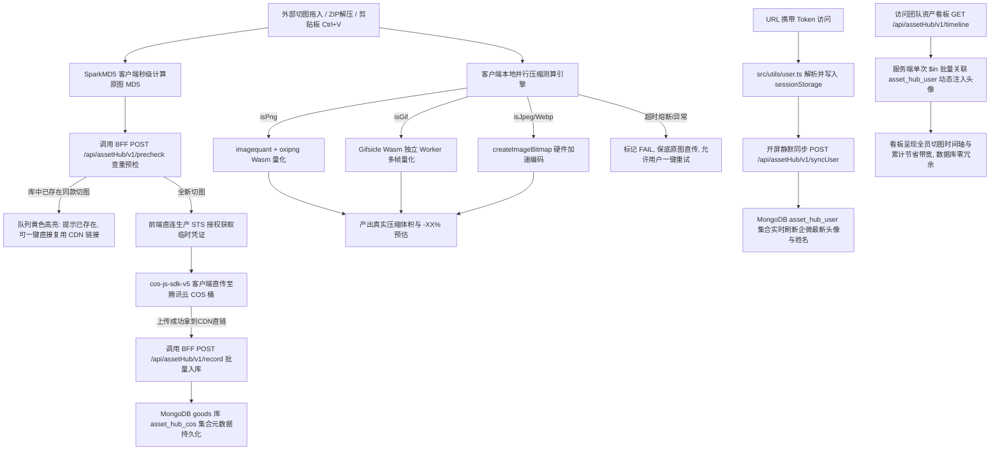

# AssetHub 前端静态资源效能工作台 - 项目核心上下文 (Core Context)

> 本文档为本项目的核心上下文档案，遵循《中文原生协议》。当新会话启动或上下文被压缩时，优先阅读本文档即可无缝恢复所有项目背景、技术决策、压缩引擎架构与开发进度。

---

## 一、项目定位与架构蓝图

### 1. 项目基本信息
* **项目名称**：AssetHub (企业级前端静态资源效能工作台)
* **所属组织**：百果园前端效能团队
* **当前 Git 分支**：`test_asset_hub`
* **前端工作目录**：`e:\source\plugin\cosUpload`
* **BFF 服务端工作目录**：`e:\project\dskhd-serverless\src`
* **运行服务**：本地开发服务运行在 `http://localhost:3000`（`yarn dev` 持续守护）

### 2. 项目背景与重构演进
原本为基于 Webpack + Vue2 的本地切图辅助插件。现全面重构升级为**企业级前端静态切图与资源治理工作台**，包含：
1. **高颜值前端独立应用**：基于 Vue 3 + Vite + TypeScript，提供超高质感拟物毛玻璃界面、拖拽/ZIP平铺解压/剪贴板捕获、1:1 物理卷帘画质对比、交付代码生成与团队资产时间轴；
2. **多引擎 WebAssembly 本地高保真量化压缩**：
   - **PNG**：集成 `imagequant` (pngquant) + `squoosh_oxipng` Wasm，实现 TinyPNG 级别 8-bit 自适应调色板量化与 Deflate 无损压缩，完美保留 Alpha 半透明与边缘羽化；
   - **GIF 动图**：集成 `gifsicle-wasm-browser` 独立 Web Worker 引擎，实现多帧动图 `-O2 --lossy=40` 帧间差分与量化瘦身（体积缩减 30%~50%），**100% 保持动画帧序列、帧延迟与循环播放**，绝不退化为静态死图；
   - **JPEG / WebP**：原生 `window.createImageBitmap` + Canvas 硬件加速编码极速测算；
   - **单图 10 秒熔断与用户一键重试**：全链路统一 10 秒超时防护，提供“已保底”与“重试”交互闭环；
3. **直连腾讯云 COS**：实测生产环境 STS 授权接口支持原生 CORS 跨域，前端获取凭据后直连 COS 存储桶上传大文件，BFF **零二进制流带宽压力**；
4. **轻量级 BFF 资产治理中枢**：专注于原图 MD5 防重查重预检（秒传）、资产元数据审计归档、团队时间轴流式大盘，以及轻量用户花名册镜像同步。

---

## 二、端到端全链路工作流



---

## 三、关键架构决策与实施细节

### 1. WebAssembly 与多线程压缩引擎架构（核心演进）
* **多 Worker 线程池与主线程零卡顿**：
  - 架构设计：[src/utils/workerPool.ts](../src/utils/workerPool.ts) 自动探测硬件并发核心数（`navigator.hardwareConcurrency`），建立 Worker 线程池；
  - 独立线程：[src/workers/pngCompressor.worker.ts](../src/workers/pngCompressor.worker.ts) 后台并行执行离屏 Canvas 像素提取、UPNG 8-bit 调色板量化与 oxipng 极大熵 Deflate 优化；
  - 管道阶段化反馈：向主线程实时派发 `DECODING`（解码）-> `QUANTIZING`（调色板量化）-> `OPTIMIZING`（极大熵提纯）三阶段进度。
* **PNG 高保真量化与 UPNG 8-bit 调色板引擎**：
  - 集成 `UPNG.js` 真正输出 8-bit Indexed Color 标准 PNG（TinyPNG 核心原理，体积直降 70%~80%），完美保留 Alpha 半透明与边缘羽化；
  - 针对原画无损（`targetColors === 0`）与毛玻璃切图，保留 32-bit RGBA 完整细节，绝不产生色阶断层。
* **超大图原画无损智能直通（Smart Pass-through）与 oxipng 自适应分级**：
  - **痛点根除**：5280 × 3760（2000万像素）等超大切图在 32-bit 原画下展开达 80MB，单线程跑行滤波计算需要近 4 亿次循环，即使给 2 分钟也会超时假死；
  - **智能直通交付**：当切图为超大图（`totalPixels > 4000000 || fileSize > 5MB`）且选择“原画无损”时，直接以 5ms 毫秒级交付原图二进制，0 算力浪费，100% 原始最高画质，彻底避免超时熔断；
  - **oxipng 级别分级**：常规图原画无损走 Level 1 快速提纯；有损量化模式常规图走 Level 2 深度提纯，超大图自适应降为 Level 1；封顶禁止 Level 3+。
* **画质比值与超时时间全链路联动**：
  - 弃用不适合 PNG 离散调色板的连续 0-100 滑动条，采用经典 3 档位：`💎 原画无损`、`⚡ 85% 标准推荐`、`📉 70% 极限瘦身`；
  - 支持动态配置单图超时：`30s (默认)` / `1m` / `2m`，支持本地免上传直接下载已压缩图。
* **GIF 动图多帧量化（绝不走 Canvas）**：
  - 引入 `gifsicle-wasm-browser` 独立 Web Worker 引擎，执行 `-O2 --lossy=40` 多帧量化瘦身（体积缩减 30%~50%），100% 保持所有动画帧、时序延迟与透明通道。
* **画质对比弹窗缩放平移与大图自适应双模 (Zoom & Pan)**：
  - **双模分流**：有体积减小时启用 1:1 卷帘比对；保底原图/原画直通/未开压缩时自适应切换为纯净高清大图预览模式，消除中线干扰并展示保底状态徽标；
  - **中心锚点缩放**：支持鼠标滚轮 10%~800% 无级缩放，按住画布自由平移，双图层像素绝对严格对齐。
* **上传流光进度条与状态指示体系**：
  - 上传中呈现极光绿渐变微流光进度条（`progress-track` + `progress-bar`）与实时百分比；
  - 处理状态指示健全：`SUCCESS` 已就绪、`UPLOADING` 进度条、`FAIL` 上传失败、`IDLE` 待上传。
* **Worker 产物构建 Banner 注入与第三方库兼容**：
  - **痛点根因**：老旧 CommonJS 库（如 `upng-js`）在未检测到 `module.exports` 时执行 `window.UPNG = UPNG`，但在现代 ES Module Web Worker 环境中根本不存在 `window` 全局对象，直接抛出 `Uncaught ReferenceError: window is not defined` 导致 Worker 崩溃；
  - **构建注入**：在 [vite.config.ts](../vite.config.ts) 的 `worker.rollupOptions.output.banner` 中注入 `if (typeof self !== "undefined" && typeof window === "undefined") { self.window = self; };`，在产物首行将 `self` 别名映射为 `window`，彻底根除老旧库在独立线程内的未定义崩溃。


### 2. COS 授权与网络拓扑
* **生产环境授权地址**：`http://example.com.cn/api/getCosAuthorization`；
* **实测结果**：HTTP 200 且 CORS 完全放行，前端直传可用；
* **凭证生命周期维护**：
  - `CosAuthStatus = 'UNAUTHORIZED' | 'READY' | 'EXPIRED'`；
  - 获取凭证后比对 `startTime` 与 `expiredTime`，确保证书处于有效窗口期，并在凭证过期前自动切换为 `EXPIRED` 状态；
  - 导航栏实时展示绿色呼吸灯就绪态或琥珀色过期态。

### 3. 用户鉴权与轻量花名册镜像方案
* **Token 解析封装**：[src/utils/user.ts](../src/utils/user.ts) 提取 `getUserInfoFromUrlToken()`，处理 Base64Url 及中文转码，缓存至 `sessionStorage`；
* **彻底移除假数据**：已删除所有静态模拟兜底用户（如“张三”），无合法 Token 访问时展示“未登录”状态；
* **未登录拦截**：未登录用户可正常查看“团队资产库”、体验 1:1 画质比对，但拦截切图直传和入库；
* **切图表彻底瘦身**：`asset_hub_cos` 表仅保留 `uploaderId`（工号索引）与 `uploaderName`（姓名），**坚决不存 `avatar` 字段**；
* **轻量镜像表**：`asset_hub_user` 表（全团队几十条记录）仅存 `userId`, `username`, `name`, `avatar`, `email`，开屏静默同步；
* **查询动态组装**：看板接口按切图列表的 `uploaderId` 内存单次匹配，历史所有切图均呈现员工企微最新头像，零多表连接性能开销。

### 4. MongoDB 数据库归属与隔离
* **连接宿主**：通过后端 `dskhd-serverless` 仓库的 `src/mongodb/dbClient.ts` 连接当前集群的 **`goods` 数据库**；
* **集合命名**：带有 `asset_hub_*` 前缀（`asset_hub_cos`、`asset_hub_user`），业务天然隔离。

### 5. 百果园品牌 VI 视觉规范
* **主按钮与强调色**：百果园生机绿 `#00A34F`（纯平无渐变，白字，无 AI 廉价感）；
* **按钮 Hover 态**：`#008C3C`；
* **次级与状态浅底**：`#E0F9E9`（搭配边框 `#B8F1CD`，文字 `#008C3C`）；
* **文本**：标题 `#000` / 主文本 `#222` / 次文本 `#666`；
* **拟态质感**：24px 超椭圆连续圆角、多层微透光毛玻璃（`backdrop-filter: blur(28px) saturate(190%)`）、动态环境呼吸光斑。

### 6. 双轨制预设体系与测试资产安全清理闭环（关键业务架构）
* **双轨制目标预设 ([src/config/cosTargets.ts](../src/config/cosTargets.ts))**：
  - **生产线上模式 (`prod-wxapp`)**：绑定 `COS_WXAPP` 密钥与 `fastdfs-prod-1251596386` 正式桶，支持选择常用 3 个业务目录（`dsxcx/images`、`dsxcx/evaluation`、`dsxcx/feedback`）及自定义输入，配备专有 CDN 加速（`https://resource.example.com.cn`）。页面打开默认优先进入生产环境；
  - **测试沙箱模式 (`test-dskhd`)**：绑定 `DSKHD` 密钥与 `test--dskhd--cos-1317204308` 测试桶，直传至 `dsxcx/temp/` 临时隔离目录；
  - **智能 URL 降级**：`resolveOnlineUrl` 在生产环境走专有 CDN，测试环境自动降级回退直连腾讯云原生源站链接，彻底解决未配置 CDN 映射导致的 404 死链。
* **安全合规底线与阅后即焚闭环**：
  - 代码层面**严禁支持 `DeleteObject`**，彻底移除前端“删除”按钮与服务端 `DeleteObject` 接口权限，防止破坏性误删生产切图；
  - 测试沙箱切图固定死锁在 `dsxcx/temp/`，其业务定位为“临时调试、阅后即焚、后续由管理员在云端批量物理清理”；
* **测试沙箱免入库归档与查重隔离 ([src/composables/useAssetQueue.ts](../src/composables/useAssetQueue.ts))**：
  - 测试沙箱上传成功后，**直接跳过 BFF `record` 入库**，杜绝测试废图的 MD5 写入云端数据库，从根源上消除了“未来云端批量清理 temp 目录后，生产环境查重误命中 404 死链”的致命隐患；
  - 测试模式录入时跳过向正式资产库发起 `precheck` 查重预检；
  - 团队资产库时间轴列表自动过滤带有 `/temp/` 或测试桶域名的脏数据，确保资产库 100% 呈现正式可用业务资产。
* **任务队列生命周期动态状态感知 ([src/components/QueueToolbar.vue](../src/components/QueueToolbar.vue))**：
  - 标题徽标智能切换：`0 项` / `共 X 项` / `上传中 S/T` (科技蓝) / `✓ 全部已完成 (X)` (翡翠绿高奢徽标) / `异常失败`；
  - 主操作按钮联动：当全量切图上传完成时，按钮自动切换为 `已全部上传` 并置灰禁用，防止重复点击。

### 7. 生产存储桶 CORS 跨域智能 CDN 探活容错机制（免运维黑科技）
* **痛点根因**：老生产桶 `fastdfs-prod-1251596386` 未在腾讯云控制台配置 Web 端 CORS 跨域规则，浏览器向腾讯云发送 PUT 请求时，虽然云端已成功保存切图落盘，但因返回缺少 `Access-Control-Allow-Origin` 响应头，被浏览器本地同源策略拦截并抛出 Network Error；
* **代码层智能探活补偿 ([src/services/cosUploader.ts](../src/services/cosUploader.ts))**：
  - 突破同源策略：利用原生 `new Image()`（`` 标签）天然不受浏览器 CORS 限制的特性；
  - 快速多频验真：捕获到 PUT 错误后，自动在 2.5 秒内对生成的线上 CDN 链接发起 3 次轻量探活；
  - 自动纠偏放行：一旦 CDN 探活成功读取到图片，说明切图已在云端就绪，SDK 自动静默纠偏为 `SUCCESS` 并放行返回线上链接，无需等待运维配置即可在开发端完美直传。

### 8. 卷帘对比器几何反向缩放补偿与小图防遮挡（工效学突破）
* **反向缩放补偿机制 ([src/components/CurtainModal.vue](../src/components/CurtainModal.vue))**：
  - 针对大图放大（如放大至 300%~800%）时卷帘分割线和手柄同频变粗、膨胀成巨型圆盘遮挡切图的缺陷，计算缩放几何倒数 `invScale = 1 / scale`，通过 CSS 变量 `--inv-scale` 注入；
  - **手柄恒定**：手柄应用 `scale(var(--inv-scale))` 抵消舞台几何放大，在任何倍率下均恒定保持 24px 紧凑精致物理尺寸；
  - **分割线恒定**：中线应用 `scaleX(var(--inv-scale))`，在任何缩放倍率下均恒定保持 1.5px 锐利发光细线；
* **全线感应与幽灵避让态**：
  - 分割线扩展左右各 12px 盲触感应区，整条垂线任意高度均可随手按住拖拽，无需强行点击中心手柄，彻底解决小图标中心被遮挡的痛点；
  - 拖拽进行中手柄自动淡出为 `opacity: 0.18` 幽灵态，通透毛玻璃质感，将 100% 视觉焦点还给切图比对像素。

### 9. 团队资产库大画幅画廊卡片重构与数据万象 WebP 缩略图（看图找图新体验）
* **以大图为主的画廊网格卡片 ([src/components/TimelineList.vue](../src/components/TimelineList.vue))**：
  - 彻底颠覆 48px 横向小列表，重构为以大图为主体的垂直画廊卡片（高度 140px，面积扩大 8~10 倍），图片成为视觉绝对焦点；
  - 下半部分紧凑陈列文件名、优化体积、物理尺寸与企微上传人信息，底部配备全宽“复制链接”微按钮；
  - 点击卡片大图舞台，无缝唤起 `CurtainModal` 全画幅看图弹窗（支持滚轮缩放、拖拽平移漫游、1:1 对齐与双击复位）；
* **自动拼接腾讯云数据万象 (CI) 轻量缩略图**：
  - 列表预览自动追加 `imageView2/2/w/320/h/320/format/webp/q/85`，等比缩放不切边，转为极小 WebP，**节省 95% 以上预览带宽流量**，首屏秒开；
  - 排除 `.svg` 与 `.gif` 动图，绑定 `@error` 自动降级回退原图，零风险防挂图；
  - 严格保持交付纯净度：点击“复制链接”与“查看大图”时，100% 交付原始物理无损原图 URL。

### 10. 环境变量规范与精简体系 ([.env](../.env) / [.env.example](../.env.example))
* **清理废弃 Key**：彻底移除 `VITE_COS_KEY`（已由预设体系自动绑定）与 `VITE_UPLOAD_DIR`（已由测试锁定/生产选择器控制）；
* **保留可选覆写项**：`VITE_COS_AUTH_URL`、`VITE_BFF_BASE_URL`、`VITE_CDN_PREFIX`、`VITE_COS_BUCKET`、`VITE_COS_REGION`，并编写详尽的中文使用场景与默认值注释。

### 11. 前端配置外置化与零重新编译交付体系（工业级交付演进，对应 PRD 29）
* **硬编码与交付痛点诊断**：
  - 传统前端构建中，`import.meta.env` 会在 `vite build` 编译期被内联写死为不可变的纯文本静态常量；
  - 生产预设的网关域名、BFF 地址、存储桶信息若直接写在 TypeScript 源码中，当运维面对机房迁移、私有云部署、多租户或换桶时，必须重新拉取源码构建，极易产生发布事故。
* **核心解决方案架构：`public/app-config.js` 外部运行时注入**：
  - 在 `public/app-config.js` 定义全局可信配置宿主 `window.__ASSET_HUB_CONFIG__`；
  - 由于 Vite 将 `public` 文件直接原封不动复制到 `dist/` 根目录，运维交付人员解压产物后，**仅用记事本即可直接修改 `dist/app-config.js`**，修改后保存刷新浏览器即刻生效，达成“一次构建，到处运行 (Build Once, Run Anywhere)”；
  - 在 `index.html` 的 `<head>` 顶部以非缓存脚本形式同步先行加载，确保早于 `main.ts` 执行。
* **四级级联覆盖机制 (Layered Cascade)**：
  - **L1 运行时外部配置 (Runtime External)**：`window.__ASSET_HUB_CONFIG__`（最高优先级，运维现场随时修改）；
  - **L2 构建期环境变量 (Build-time Env)**：`import.meta.env`（CI/CD 流水线与本地调试）；
  - **L3 代码内置默认兜底 (Fallback Defaults)**：源码容错保底；
  - **L4 用户界面交互记忆 (UI Session Storage)**：记录开发者选中的目录和配置。
* **无限环境扩展与环境联动全闭环**：
  - 解耦预设 ID 字面量联合类型约束，允许在 `app-config.js` 中自由定义 1 个到 N 个环境预设（如 Dev/Test/Staging/Prod/Overseas）；
  - 将常用业务文件夹配置外置为 `prodDirPresets` 数组，彻底摆脱百果园单一小程序业务目录硬绑定；
  - BFF 服务端请求客户端（`assetBff.ts`）动态跟随当前激活环境的 `bffBaseUrl`，界面切换目标环境时，查重秒传预检、入库归档与时间轴大盘接口全链路同步联动，彻底根除配置割裂。

### 12. Vite 构建工程化体系与精细化拆包架构（Rolldown / Vite 8 适配，对应 PRD 33）
* **生产相对路径基准 (`base: './'`)**：
  - 彻底摆脱对域名绝对根路径 `/` 的刚性依赖，使所有 JS/CSS/Worker Chunk 以及资源引用均基于当前页面相对层级寻址；
  - 完美兼容深层子目录、微前端容器以及带有多级网关前缀的反向代理环境（如 `/api/cos/proxy/e/...`）。
* **Rolldown / Vite 8 规范的函数式 `manualChunks` 精细化分包**：
  - **规范适配**：由于 Vite 8 底层采用 Rolldown 引擎，对象式 `manualChunks` 已被废弃，代码严格遵循函数签名 `manualChunks(id: string)` 动态判定；
  - **专有 SDK 独立分包**：将大型云存储直传库单独打包为 `vendor-cos`（约 164KB，包含 `cos-js-sdk-v5`），将大文件打包组件切分为 `vendor-zip`（约 96KB，包含 `jszip`）；
  - **基础依赖聚合**：通用响应式与哈希工具（`vue`、`spark-md5` 等）聚合到 `vendor`（约 141KB）；
  - **极致缓存效益**：业务核心代码变更时，大型第三方依赖 Chunk 的哈希保持不变，实现浏览器的极致物理持久缓存与按需并行加载。
* **Web Worker 构建兼容性保障与 Banner 注入**：
  - 在 `vite.config.ts` 配置 `worker: { format: 'es', rollupOptions: { output: { banner: '...' } } }`；
  - 在打包产物首行自动注入：`if (typeof self !== "undefined" && typeof window === "undefined") { self.window = self; };`；
  - 彻底治愈老旧 CommonJS 库（如 `upng-js` 源码中 `else { window.UPNG = UPNG; }`）在纯 Worker 线程中访问不存在的 `window` 对象抛出 `Uncaught ReferenceError: window is not defined` 的行业顽疾。

---

## 四、核心工程文件结构速查

### 1. 前端工程 (`e:\source\plugin\cosUpload`)
```
src/
├── config/
│   ├── apiConfig.ts          # 环境变量映射与 API 常量定义
│   └── cosTargets.ts         # 双轨制环境目标预设、业务目录调度与 CDN/原生智能 URL 解析
├── types/
│   └── asset.ts              # 队列项 (含 compressStatus/compressStage)、用户信息、时间轴类型定义
├── lib/
│   └── wasm/
│       ├── imagequant.js     # pngquant Wasm 胶水层
│       ├── squoosh_oxipng.js # oxipng Wasm 胶水层
│       ├── gifsicle.js       # Gifsicle Wasm 胶水层 (内置 Worker 与 Base64 字节码)
│       ├── UPNG.js           # 真正的 8-bit 调色板索引色量化引擎
│       └── wasm.d.ts         # Wasm 模块 TypeScript 声明
├── workers/
│   └── pngCompressor.worker.ts # 独立后台 Web Worker，执行像素提取、UPNG量化与oxipng提纯
├── utils/
│   ├── workerPool.ts         # Worker 线程池调度管理器 (按 CPU 核心数并发派发)
│   ├── compressScheduler.ts  # 压缩任务调度器 (支持排队、阶段化进度流与倒计时)
│   ├── compressor.ts         # 浏览器端统一压缩入口 (精准分流、动态超时熔断)
│   ├── wasmCompressor.ts     # PNG Wasm 量化与 Deflate 无损压缩调度器 (主线程降级兜底)
│   ├── gifCompressor.ts      # GIF 动图多帧量化压缩调度器 (独立 Worker)
│   ├── file.ts               # 文件工具库 (detectScaleBadge正则提取 @2x/@3x)
│   ├── user.ts               # URL Token 解析、会话缓存、真实鉴权与静默同步
│   ├── md5.ts                # SparkMD5 客户端原图散列计算
│   ├── zip.ts                # JSZip 内存解压平铺工具
│   ├── format.ts             # 字节容量与多端代码模版格式化
│   ├── clipboard.ts          # 现代异步剪贴板操作 (兼容 iframe Permissions Policy 降级)
│   ├── wasmLoader.ts         # Wasm 静态资源动态寻址与环境自适应加载器
│   └── title.ts              # 跨域 iframe 父页面网页标题同步与消息广播工具
├── services/
│   ├── cosUploader.ts        # 腾讯云官方 COS SDK 直传服务封装与 STS 凭证生命周期
│   └── assetBff.ts           # BFF 交互客户端 (precheck, record, timeline, syncUser)
├── composables/
│   ├── useAssetQueue.ts      # 资产任务队列核心状态与批量操作调度
│   └── useToast.ts           # iOS 物理微动画轻提示调度
├── components/
│   ├── Navbar.vue            # 高透光导航，展示真实工号/企微头像/COS授权生命周期
│   ├── Dropzone.vue          # 文件拖拽、ZIP、剪贴板捕获托盘
│   ├── QueueToolbar.vue      # 批量操作栏，集成 AppleSelect 美化画质/超时选择器与下载全部
│   ├── QueueTable.vue        # 资产表格，高透微磨砂卡片，流光进度条与状态指示
│   ├── AppleSelect.vue       # Apple 极简晶透毛玻璃下拉选择器 (带外部点击收起与旋转微标)
│   ├── TimelineList.vue      # 团队时间轴看板，支持我的上传筛选与微头像
│   ├── CurtainModal.vue      # 1:1 画质比对与高清大图双模查看器 (支持 10%~800% 锚点缩放与平移)
│   ├── CodeModal.vue         # 交付代码生成器 (Vue/小程序/CSS/React)
│   └── Toast.vue             # 悬浮微轻提示
├── styles/
│   └── variables.css         # 百果园设计系统 CSS 变量与设计令牌
├── App.vue                   # 主页面容器，解耦并发触发压缩测算与重试调度
└── main.ts                   # 应用入口
public/
├── app-config.js             # 运行时外部动态交付配置文件 (运维现场用记事本即可编辑，零重新编译)
└── wasm/
    ├── imagequant.wasm       # pngquant 核心 Wasm 二进制
    └── squoosh_oxipng_bg.wasm# oxipng 核心 Wasm 二进制
```

### 2. BFF 服务端工程 (`e:\project\dskhd-serverless\src`)
```
src/
├── mongodb/models/assetHub/
│   ├── CosAsset.ts           # asset_hub_cos 切图持久化模型 (rawMd5查重主键)
│   ├── AssetUser.ts          # asset_hub_user 企微花名册镜像模型
│   └── Readme.md             # 数据模型定位与设计说明文档
├── api/assetHub/v1/
│   ├── precheck.post.ts      # 切图查重秒传预检接口
│   ├── record.post.ts        # 资产元数据批量入库接口
│   ├── timeline.get.ts       # 团队时间轴大盘与流量统计接口
│   └── syncUser.post.ts      # 开发者企微头像与姓名静默同步接口
└── const/api/
    ├── assetHubApi.ts        # 独立声明的 AssetHub 接口免签开放清单
    └── unAuthApi.ts          # 集中汇总的免校验白名单入口
```

---

## 五、PRD 需求与设计文档全量索引

项目所有设计决策与产品需求均已在 `PRD/` 目录下全量归档：
* [01_前端静态资源工作台转型PRD与架构方案.md](../PRD/01_前端静态资源工作台转型PRD与架构方案PRD.md)
* [02_视觉高奢去AI味与高透光重构PRD.md](../PRD/02_视觉高奢去AI味与高透光重构PRD.md)
* [03_前端组件化拆分与柔和质感按钮重构.md](../PRD/03_前端组件化拆分与柔和质感按钮重构.md)
* [04_BFF服务端轻量资产治理与接口方案PRD.md](../PRD/04_BFF服务端轻量资产治理与接口方案PRD.md)
* [05_轻量用户花名册与Token解析方案PRD.md](../PRD/05_轻量用户花名册与Token解析方案PRD.md)
* [06_严格鉴权与COS凭证生命周期管理PRD.md](../PRD/06_严格鉴权与COS凭证生命周期管理PRD.md)
* [07_去硬编码与直传环境真实化改造PRD.md](../PRD/07_去硬编码与直传环境真实化改造PRD.md)
* [08_升级WebAssembly高性能本地图片压缩引擎PRD.md](../PRD/08_升级WebAssembly量化本地图片压缩引擎PRD.md)
* [09_支持GIF动图WebAssembly量化压缩PRD.md](../PRD/09_支持GIF动图WebAssembly量化压缩PRD.md)
* [10_队列工具栏清空功能改造PRD.md](../PRD/10_队列工具栏清空功能改造PRD.md)
* [11_修复Wasm量化函数名与超时定时器泄漏PRD.md](../PRD/11_修复Wasm量化函数名与超时定时器泄漏PRD.md)
* [12_PNG熔断保底原图与30秒超时改造PRD.md](../PRD/12_PNG熔断保底原图与30秒超时改造PRD.md)
* [13_WebWorker后台多线程与串行倒计时改造PRD.md](../PRD/13_WebWorker后台多线程与串行倒计时改造PRD.md)
* [14_压缩阶段化管道进度优化PRD.md](../PRD/14_压缩阶段化管道进度优化PRD.md)
* [15_集成UPNG真正8bit索引色PNG压缩引擎PRD.md](../PRD/15_集成UPNG真正8bit索引色PNG压缩引擎PRD.md)
* [16_压缩画质比值调节与本地直接下载压缩图PRD.md](../PRD/16_压缩画质比值调节与本地直接下载压缩图PRD.md)
* [17_画质与超时美化毛玻璃表格与倍率徽标精准化PRD.md](../PRD/17_画质与超时美化毛玻璃表格与倍率徽标精准化PRD.md)
* [18_画质对比弹窗缩放平移与大图自适应双模PRD.md](../PRD/18_画质对比弹窗缩放平移与大图自适应双模PRD.md)
* [19_上传进度条与处理状态指示系统全面恢复PRD.md](../PRD/19_上传进度条与处理状态指示系统全面恢复PRD.md)
* [20_双轨制COS预设管理与测试资产清理闭环PRD.md](../PRD/20_双轨制COS预设管理与测试资产清理闭环PRD.md)
* [21_测试沙箱temp目录隔离与生产自定义文件夹及工具栏重构PRD.md](../PRD/21_测试沙箱temp目录隔离与生产自定义文件夹及工具栏重构PRD.md)
* [22_清理环境变量冗余Key与可选注释规范PRD.md](../PRD/22_清理环境变量冗余Key与可选注释规范PRD.md)
* [23_任务队列工具栏动态状态感知与全部完成胶囊PRD.md](../PRD/23_任务队列工具栏动态状态感知与全部完成胶囊PRD.md)
* [24_测试沙箱免入库与时间轴看板纯净过滤PRD.md](../PRD/24_测试沙箱免入库与时间轴看板纯净过滤PRD.md)
* [25_COS跨域拦截智能CDN探活容错补偿PRD.md](../PRD/25_COS跨域拦截智能CDN探活容错补偿PRD.md)
* [26_卷帘对比器分割线反向缩放补偿与小图防遮挡优化PRD.md](../PRD/26_卷帘对比器分割线反向缩放补偿与小图防遮挡优化PRD.md)
* [27_时间轴看板点击缩略图查看大图PRD.md](../PRD/27_时间轴看板点击缩略图查看大图PRD.md)
* [28_时间轴看板大画幅画廊卡片重构与COS缩略图优化PRD.md](../PRD/28_时间轴看板大画幅画廊卡片重构与COS缩略图优化PRD.md)
* [29_前端配置外置化与零重新编译交付方案PRD.md](../PRD/29_前端配置外置化与零重新编译交付方案PRD.md)
* [30_移除代码内置兜底并支持未配置友好提示PRD.md](../PRD/30_移除代码内置兜底并支持未配置友好提示PRD.md)
* [31_iframe嵌套父页面网页标题同步方案PRD.md](../PRD/31_iframe嵌套父页面网页标题同步方案PRD.md)
* [32_API统一收拢与iframe剪贴板及读端清洗重构PRD.md](../PRD/32_API统一收拢与iframe剪贴板及读端清洗重构PRD.md)
* [33_iframe微前端子路径与Wasm和Worker相对寻址重构PRD.md](../PRD/33_iframe微前端子路径与Wasm和Worker相对寻址重构PRD.md)

---

## 六、前端配置纯净外置化与 iframe 宿主标题同步体系 (PRD 29, 30, 31 & 32 已全面落地)

已彻底根除前端工程中所有目标预设、存储桶参数、接口网关与常用目录的代码内置兜底预设：
1. **单一真实来源 (Single Source of Truth)**：彻底删除 `DEFAULT_TARGET_PRESETS`，存储桶预设和业务目录 100% 仅从 `window.__ASSET_HUB_CONFIG__` 读取，代码内不保留任何百果园内网桶或域名的隐式兜底；
2. **零内置兜底状态感知**：当 `app-config.js` 未配置或 targets 数组为空时，系统自动识别为“未配置”状态（`isCosConfigured = false`，`currentCosTarget = null`）；
3. **全链路未配置界面友好提示**：
   - 主工作台顶部浮现醒目的琥珀色毛玻璃警示横幅（Alert Banner），清晰指引在 `app-config.js` 中补充配置；
   - 导航栏右上角指示微胶囊呈现“未配置环境”中性警示态；
   - 任务队列工具栏环境选择器置灰并展示“未配置环境”，目录显示“⚠️ 未配置目录”，主上传按钮置灰禁用；
   - 拦截未配置时的查重预检与上传操作，杜绝运行时报错与白屏；
4. **外置运行时配置文件**：`public/app-config.js`（打包直出于 `dist/app-config.js`），实施运维现场使用记事本修改后按 F5 即可生效；
5. **全链路动态联动**：`assetBff.ts` 动态跟随当前激活环境的 `bffBaseUrl`，彻底消除环境配置割裂；
6. **iframe 代理子路径与 Wasm/Worker 相对寻址自适应 (PRD 33)**：生产构建统一配置 `base: './'`，引入 `src/utils/wasmLoader.ts` 动态计算 `getWasmAssetUrl`，并在 `index.html` 注入无斜杠代理子路径动态 `<base>` 标签补偿，彻底根除 Worker 与 Wasm 因绝对路径请求域名根目录 404 引发的运行时崩溃。

---

## 七、下一步推进建议

1. **真实多类型切图批量直传验证**：使用实际业务场景中的 PNG（带透明羽化）、JPG（高清大图）、GIF（多帧动效表情包）进行生产线上与测试沙箱的混合批量拖拽，验证秒传、压缩比与直传稳定性；
2. **腾讯云控制台补充生产桶 CORS 配置（可选）**：虽然代码已支持智能 CDN 探活自动容错，后续有权限时可在腾讯云控制台为 `fastdfs-prod-1251596386` 添加一条允许 Origin 的 CORS 规则，实现云端最彻底直通；
3. **测试环境分支合并与部署**：将当前 `test_asset_hub` 分支提交并在测试环境发布，进行内网跨端联调；
4. **团队推广与反馈收集**：向相关前端和 UI 同学开放使用，验证工作台效率提升效果。
